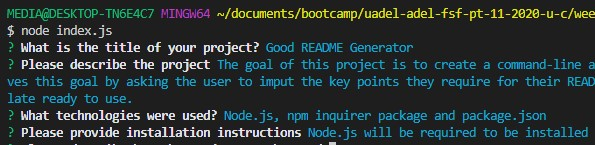

# Good README Generator


  ## Description
The goal of this project is to create a command-line application that allows the user to generate a README.md file quickly and easily. The project achieves this goal by asking the user to imput the key points they require for their README file into the command-line, which then slots in this information into a pre-written README template ready to use. 

## Table of Contents 

* [Installation](#installation)
* [Usage](#usage)
* [License](#License)
* [Contributing](#contributing)
* [Test](#test)
* [Questions](#questions)

## Installation
The technologies used for this project include Node.js, npm inquirer package and package.json. Node.js will be required to be installed before using this application. 

## Usage
This application is easily run by opening the file index.js, entering the command ```node index.js``` into the command-line and proceeding to answer the questions that follow. This is an example of how it looks at this stage  When all the questions have been answered, a README.md file will be generated with all of the answers to these questions. 

## License 
Permission is hereby granted, free of charge, to any person obtaining a copy of this software and associated documentation files(the "Software"), to deal in the Software without restriction, including without limitation the rights to use, copy, modify, merge, publish, distribute, sublicense, and / or sell copies of the Software, and to permit persons to whom the Software is furnished to do so, subject to the following conditions: The above copyright notice and this permission notice shall be included in all copies or substantial portions of the Software. THE SOFTWARE IS PROVIDED "AS IS", WITHOUT WARRANTY OF ANY KIND, EXPRESS OR IMPLIED, INCLUDING BUT NOT LIMITED TO THE WARRANTIES OF MERCHANTABILITY, FITNESS FOR A PARTICULAR PURPOSE AND NONINFRINGEMENT.IN NO EVENT SHALL THE AUTHORS OR COPYRIGHT HOLDERS BE LIABLE FOR ANY CLAIM, DAMAGES OR OTHER LIABILITY, WHETHER IN AN ACTION OF CONTRACT, TORT OR OTHERWISE, ARISING FROM, OUT OF OR IN CONNECTION WITH THE SOFTWARE OR THE USE OR OTHER DEALINGS IN THE SOFTWARE.

## Contributing
Anyone is welcome to contribute to this project as per the guidlines by the [Contributor Covenant](assets/contributor.md)

## Test
No tests are currently available

## Questions
If you have any questions or would like further information on this project, 
please contact silviataliana2@gmail.com or find me on [Github](https://github.com/silvia-taliana).
